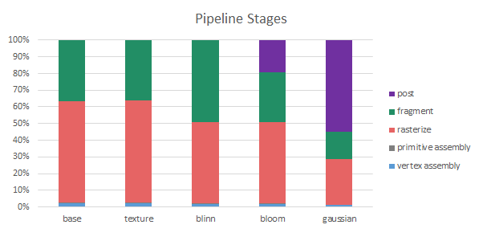

CUDA Rasterizer
===============

**University of Pennsylvania, CIS 565: GPU Programming and Architecture, Project 4**

Sarah Forcier

Tested on GeForce GTX 1070

### Overview

This project implements the rasterization pipeline on the GPU using CUDA (see pipeline below).  

A set of prepackaged buffers for position, normal, uv, etc from a parsed glTF file is passed to vertex assembly. In this stage and the Vertex Shader, vertices are transformed from world space to screen space via view space, clipping space, and NDC space. Special care is taken when transforming normals so as not to apply a scale transform. Below are some of the vertex attributes set in these stages.    

| Normal | Position | Depth | UV |
| ----------- | ----------- | ----------- | ----------- |
|  |  |  |  |

In the next stage, individual vertices are combined to form triangles. Primitive assembly uses the indices array and the positions array to form an array such that every three values corresponds to one primitive triangle. 

The rasterization step forms fragments from primitives. On the GPU, the algorithm is parallelized by primitive, so for each triangle and each fragment inside the triangle's axis-aligned bounding box, the fragment is shaded if it is inside the triangle. This test is achieved with barycentric coordinates, which are also used to interpolate vertex attributes within the triangle. 

Fragments are not considered pixels because some overlap each other, so a depth test is needed to resolve which fragments to write to the frame buffer. Since fragments are evaluated in parallel, comparing their depths causes a race condition. Thus we need an atomic operator to force only one thread at a time to update the closest fragment. I created a buffer to store mutexes for each pixel. When the mutex is 1, a another thread is updating the depth value, and when the value is 0, a thread can operate atomicCAS to update the value. 

Finally the fragments are colored in the fragment shader based on their color and normals.   

Additional features can be implemented in the per-fragment tests and blend stages. The image is written to the framebuffer in the last stage.      

### Features

#### Materials

##### Lambertian

A simple Fragment shader. A point light is at the eye position. 

| Cow | Duck | Truck |
| ----------- | ----------- | ----------- |
|  |  |  |

##### Blinn-Phong

A modified Phong reflection model to handle specular surfaces, approximating light ray behavior. 

| Cow | Duck | Truck |
| ----------- | ----------- | ----------- |
|  |  |  |

##### Textures

Texture maps can be helpful for providing extra detail without increasing triangle count. A fragment's color is looked up in an image at the fragment's texture coordinates. 

| Default UV mapping | with Perspective Correction | with Bilinear Filtering |
| ----------- | ----------- | ----------- |
|  |  |  |

Bilinear filtering smooths the mapped texture by interpolating a color value between the four pixel colors around a fragment's uv coordinates. This eliminates image artifacts. 

Interpolation is performed on attributes in screen space, but this does not account for perspective. In order to interpolate for perspective correct textures, attributes need to be interpolated by 1/depth. 

#### Post Processing
##### Gaussian Blur

A Gaussian Blur takes a weighted average of a pixel's neighbors. This type of post-processing effect leds itself easily to a shared memory implementation, because nearby neighbors require the same memory. To simplify even further, a 2D gaussian blur can be deconstructed into 2 1D blurs. Thus a single block can load a row or column into shared memory for the horizontal and vertical gaussian kernels respectively.

| Cow | Duck | Truck |
| ----------- | ----------- | ----------- |
|  |  |  |

##### Bloom

A bloom effect is performed in 3 steps: First the intensity values of every pixel are passed through a high-pass filter. The resulting black and white image is blurred using the gaussian filter described above. Finally this blurred, now-grayscale image is added to the original image. 

| Cow | Duck | Truck |
| ----------- | ----------- | ----------- |
|  |  |  |

### Performance

A majority of time per frame is spent in the rasterization and fragment shader stage of the pipeline.This distribution is to be expected since these stages operate on the most number of objects (numFragments > numPrimitives), these stages require the most calculations.  

Blinn-Phong shading requires extra time in the fragment shader due to additional computation and a computationally expensive power operation. 

Post-processing effects also require a lot of time since calculations are performed on every fragment, so we should expect post processing to take a similar amount of time to shading. This is true of bloom, but gaussian blur takes more even though the bloom algorithm also does a gaussian blur. The difference is that bloom operates on a float buffer, whereas gaussian operates of vector RGB colors, taking around 3x as long.  

Performance calculated on the duck scene. 

### Credits

* [tinygltfloader](https://github.com/syoyo/tinygltfloader) by [@soyoyo](https://github.com/syoyo)
* [glTF Sample Models](https://github.com/KhronosGroup/glTF/blob/master/sampleModels/README.md)
