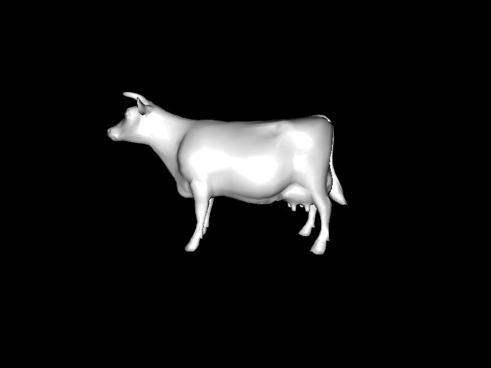

CUDA Rasterizer
===============

**University of Pennsylvania, CIS 565: GPU Programming and Architecture, Project 4**

Sarah Forcier

Tested on GeForce GTX 1070

### Overview

### Features

#### Materials

##### Lambertian

| Cow | Duck | Truck |
| ----------- | ----------- | ----------- |
|  |  |  |

##### Blinn-Phong

| Cow | Duck | Truck |
| ----------- | ----------- | ----------- |
|  |  |  |

##### Textures

| Default UV mapping | with Perspective Correction | with Bilinear Filtering |
| ----------- | ----------- | ----------- |
|  |  |  |

#### Tile-based pipeline 

### Credits

* [tinygltfloader](https://github.com/syoyo/tinygltfloader) by [@soyoyo](https://github.com/syoyo)
* [glTF Sample Models](https://github.com/KhronosGroup/glTF/blob/master/sampleModels/README.md)
